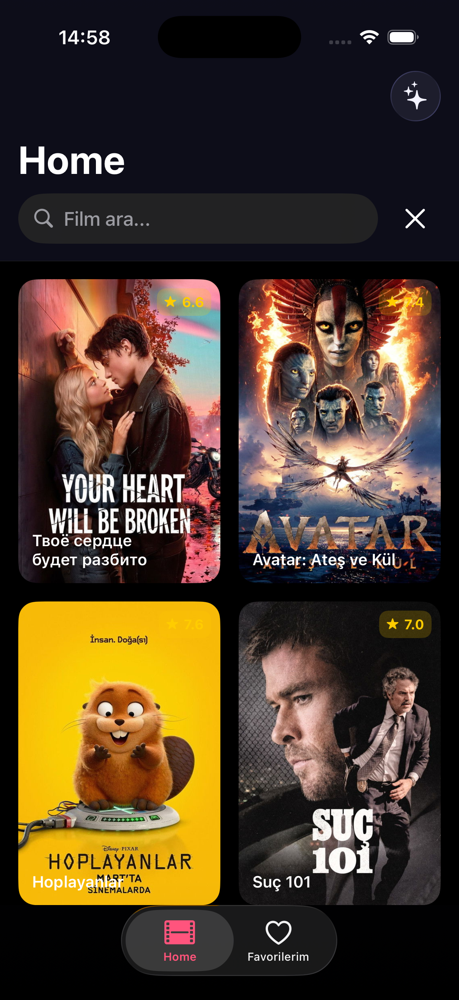
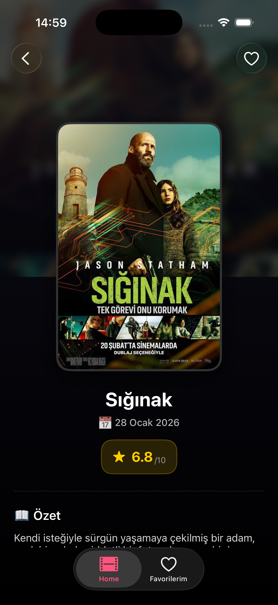
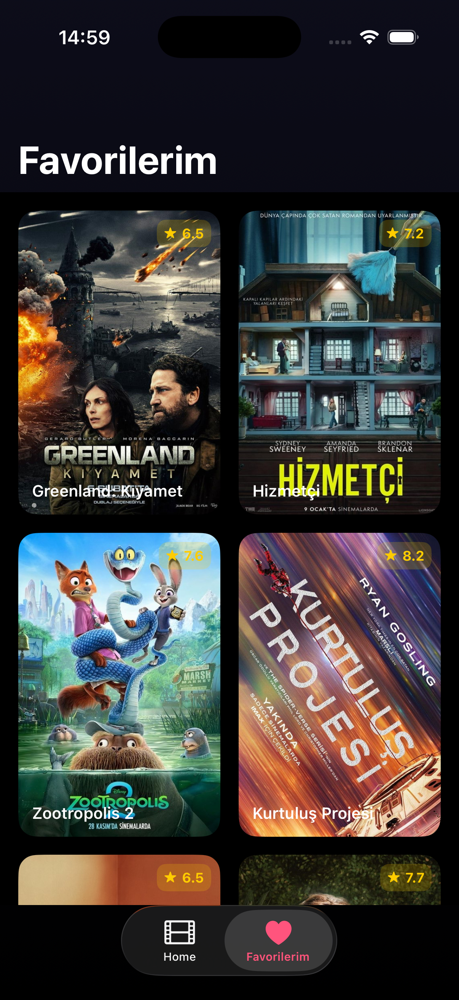
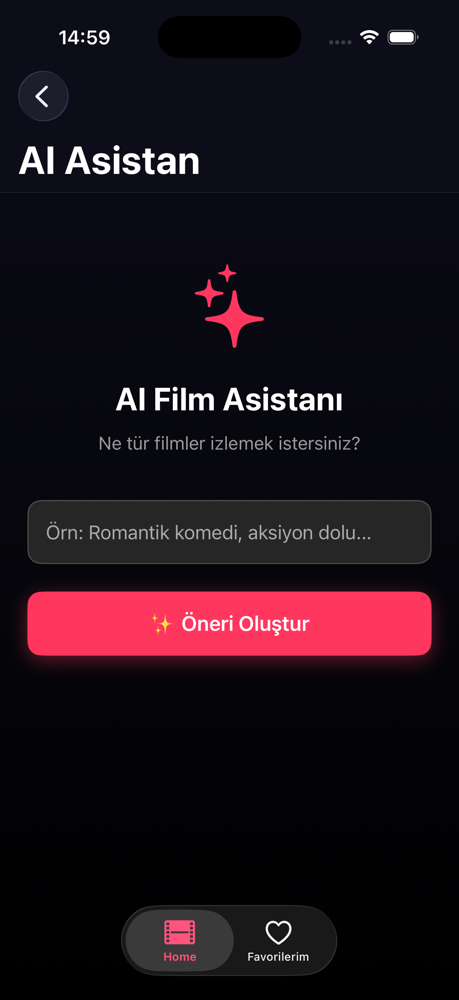
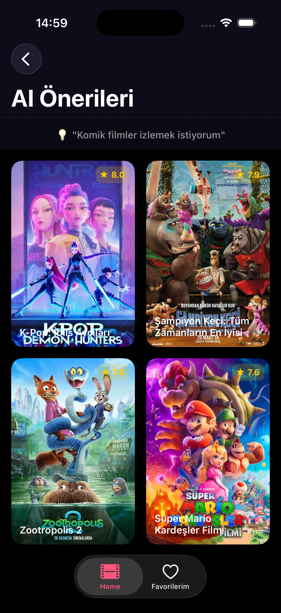

# 🎬 AISmartDirector

**AISmartDirector**, kullanıcıların ruh hallerine ve tercihlerine göre yapay zeka destekli film önerileri sunan, modern iOS teknolojileriyle geliştirilmiş akıllı bir film asistanıdır.

## ✨ Öne Çıkan Özellikler

* **🤖 AI Mood Analysis:** Google Gemini API entegrasyonu sayesinde doğal dil girdilerini analiz ederek kullanıcıya özel kategori eşleştirmeleri yapar.
* **⚡ Parallel Data Fetching:** Swift Concurrency (`TaskGroup`) kullanarak birden fazla kategorideki veriyi TMDB API üzerinden **paralel** şekilde çekerek maksimum performans sağlar.
* **🔍 Akıllı Arama:** Hem yapay zeka destekli ruh hali araması hem de doğrudan film ismiyle arama yapabilme imkanı sunar.
* **❤️ Favori Yönetimi:** Beğenilen filmleri takip etmek için `FavoritesManager` ile kurgulanmış özel bir favori sistemi içerir.
* **📱 Modern UI/UX:** SnapKit ile programatik Auto Layout, koyu tema desteği ve akıcı navigasyon yapısı.

## 🛠 Kullanılan Teknolojiler

| Kategori | Teknoloji |
| :--- | :--- |
| **Dil** | Swift (UIKit) |
| **Mimari** | MVVM + Coordinator Pattern |
| **AI Motoru** | Google Gemini (Generative AI) |
| **Veri Kaynağı** | TMDB API (The Movie Database) |
| **Layout** | SnapKit |
| **Resim İşleme** | Kingfisher (Caching & Blur Effects) |
| **Concurrency** | Async/Await & TaskGroup |

## 🏗 Mimari Yapı

Proje, sürdürülebilirlik ve test edilebilirlik prensiplerine uygun olarak **MVVM (Model-View-ViewModel)** deseniyle kurgulanmıştır. Navigasyon mantığı, ViewController'lardan tamamen soyutlanarak **Coordinator Pattern** ile merkezi bir noktadan yönetilmektedir.

```text
AISmartDirector/
├── App/               # AppDelegate, SceneDelegate, başlangıç konfigürasyonları
├── Core/              # Network, Model ve yardımcı araçlar
├── Navigation/        # Coordinator Pattern (AppCoordinator vb.)
├── Resources/         # Assets, Colors, Localizable vs.
├── Screen/            # Tüm ekranlar (Home, Detail, AI Assistant)
├── Services/          # API servisleri (Gemini, TMDB)
├── Test/              # Unit & Mocking test senaryoları (XCTest)
├── Secrets/           # API key ve hassas bilgiler (plist)
    
```
## 🧪 Test Stratejisi & Kalite Güvencesi

Projenin güvenilirliğini ve uzun vadeli bakım kolaylığını sağlamak amacıyla **Unit Test** süreçleri titizlikle kurgulanmıştır.

### Birim Testleri (Unit Testing)
Uygulamanın temel mantığı, Apple’ın **XCTest** çatısı kullanılarak kapsamlı bir şekilde test edilmektedir. Özellikle AI tarafından üretilen film kategorilerini TMDB’nin beklediği kategori ID’lerine dönüştüren **GenreMapper** gibi kritik bileşenler test kapsamına alınmıştır.

### Mocking & Dependency Injection
`MovieServiceProtocol` kullanılarak geliştirilen **MockMovieService** sayesinde, network katmanı tamamen izole edilmiştir. Bu sayede:
- Testler internet bağlantısına ihtiyaç duymaz,
- Testler çok daha hızlı çalışır,
- Dış bağımlılıklar (API çağrıları) nedeniyle testler kırılgan hale gelmez,
- Gerçek servis yerine kontrollü ve öngörülebilir davranışlar test edilebilir.

### Given-When-Then Disiplini
Tüm test senaryoları, kod okunabilirliğini ve profesyonel yazılım mühendisliği standartlarını korumak amacıyla **Given-When-Then** (GWT) yapısıyla yazılmıştır. Bu yaklaşım sayesinde testlerin amacı, akışı ve beklenen sonucu net bir şekilde anlaşılır.

---

**Kullanılan Test Yaklaşımları:**
- **Unit Testing** ile çekirdek mantığın doğrulanması
- **Mocking** ile izolasyon ve hız
- **Given-When-Then** ile okunabilir ve sürdürülebilir test kodları

---

## 📸 Ekran Görüntüleri

<p align="center">
  
  &nbsp;&nbsp;&nbsp;&nbsp; 
  
  &nbsp;&nbsp;&nbsp;&nbsp;
  
  &nbsp;&nbsp;&nbsp;&nbsp;
  
  &nbsp;&nbsp;&nbsp;&nbsp;
  
</p>

---
  
## 🚀 Kurulum

**1. Projeyi klonlayın:**
```bash
git clone https://github.com/eceakcay/AISmartDirector.git
cd AISmartDirector
```

**2. Bağımlılıkları yükleyin** (SPM veya CocoaPods).

**3. `Secrets.plist` dosyasını oluşturun** ve API anahtarlarınızı ekleyin:
```xml

<?xml version="1.0" encoding="UTF-8"?>
<!DOCTYPE plist PUBLIC "-//Apple//DTD PLIST 1.0//EN" "http://www.apple.com/DTDs/PropertyList-1.0.dtd">
<plist version="1.0">
<dict>
    <key>GEMINI_API_KEY</key>
    <string>YOUR_API_KEY_HERE</string>
</dict>
</plist>


```

**4. Projeyi Xcode üzerinden çalıştırın.**

AISmartDirector.xcodeproj (veya varsa .xcworkspace) dosyasını Xcode ile açın ve Cmd + R ile çalıştırın.

---

## 👩🏻‍💻 Geliştirici

**Ece Akçay** — Bilgisayar Mühendisliği Öğrencisi & iOS Developer
